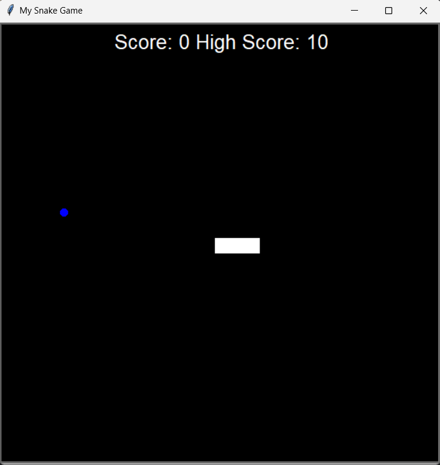

# 🐍 Snake Game

Welcome to the **Snake Game**! This is a Python-based game that brings the classic Snake Game to life using Turtle Graphics. Enjoy the thrill of guiding the snake to collect food, grow longer, and try to beat your high score!

---

## 🎮 Game Features

- **Interactive Gameplay**: Control the snake's direction using the arrow keys to collect food and grow longer.
- **High Score Tracking**: Your highest score is saved locally in a file (`data.txt`), allowing you to keep track of your personal best.
- **Collision Detection**: The game ends when the snake collides with the wall or its own tail.

---

## 📂 Project Files

| File            | Description                                       |
|-----------------|---------------------------------------------------|
| **main.py**     | Main script to run the game and initialize objects.|
| **snake.py**    | Contains the `Snake` class to control snake behavior.|
| **food.py**     | Contains the `Food` class for food item properties.|
| **scoreboard.py** | Manages the score display and high score logic.|
| **images/**     | Folder containing game screenshots.|

---

## 🛠️ Requirements

- **Python 3.x**
- **Turtle Graphics** (comes pre-installed with Python)

---

## 🚀 Getting Started

1. **Clone the repository**:
   ```bash
   git clone https://github.com/shrutimsontakke/snake-game.git
   ```

2. **Navigate to the project folder**:
   ```bash
   cd snake-game
   ```

3. **Run the game**:
   ```bash
   python main.py
   ```

---

## 🎮 Controls

Use the arrow keys on your keyboard:
- **Up Arrow**: Move Up
- **Down Arrow**: Move Down
- **Left Arrow**: Move Left
- **Right Arrow**: Move Right

---

## 📸 Screenshot

Here's a preview of the game in action:



---

## 📝 How to Play

1. **Start the game**: Control the snake to move in different directions.
2. **Collect Food**: Guide the snake towards the food to collect it. Each piece of food makes the snake grow longer and increases your score.
3. **Avoid Collisions**: The game ends if the snake collides with the wall or its own body.

---

## 🤝 Contributing

Contributions are welcome! Fork the repository, make your improvements, and submit a pull request. Together, let’s make the Snake Game more fun and challenging!

---

